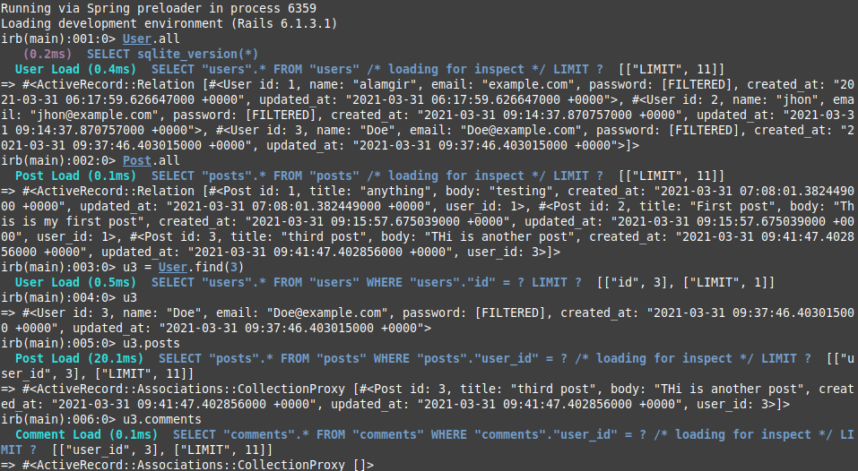

# Active Records Model of Micro-Reddit

This project is an application similar to Reddit (called Micro-Reddit) where a user can create a post and add comments to it.



## Build-With

- Ruby -v  2.7.1
- Rails -v 6.1
- SQLite3


## Getting Started

### Prerequisites

To get this project up and running locally, you must already have ruby and necessary gems installed on your computer

**To get this project set up on your local machine, follow these simple steps:**

1. Open Terminal.
2. Navigate to your desired location to download the contents of this repository.
3. Copy and paste the following code into the Terminal: git clone https://github.com/M-Alamgir/micro-reddit-rails
4. Run ```micro-reddit-rails```.
5. Run ```bundle install``` to get the necesary gems.
6. Run `rails db:migrate`.

👤 **Alamgir**

- GitHub: [@Alamgir](https://github.com/M-Alamgir)
- Twitter: [@Alphacrescent1](https://twitter.com/Alphacrescent1)

## Acknowledgment
The resources we have used to develop our project:

- [Odin-project](https://www.theodinproject.com/courses/ruby-on-rails/lessons/building-with-active-record-ruby-on-rails)

## Show your support

Give ⭐ Star me on GitHub — it helps!

## 🤝 Contributing

Contributions, issues, and feature requests are welcome!

## 📝 License

This project is [MIT](https://opensource.org/licenses/MIT) licensed. 
